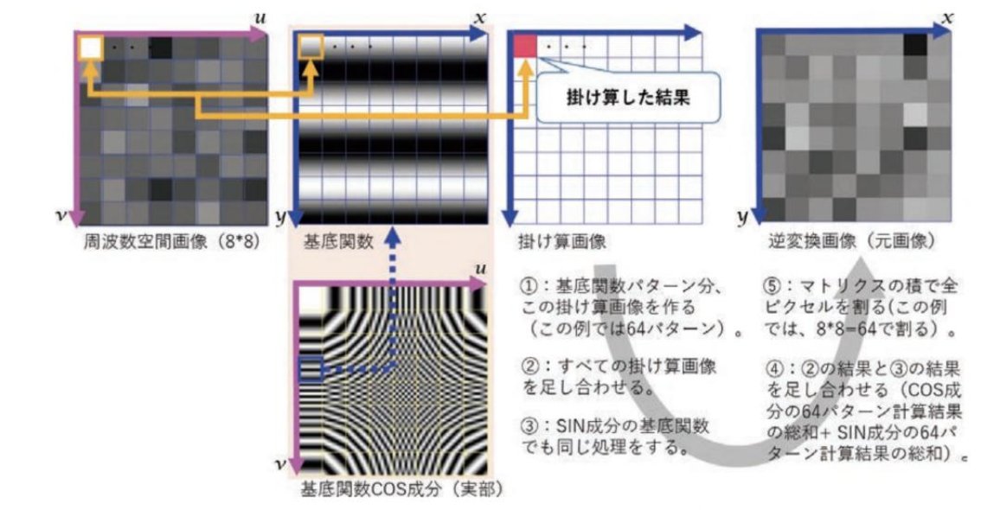

# はじめに

この文章では、FFTやwavelet技術を用いた「画像の信号処理」や「画像分類方法」について調べた際に学んだサイトをまとめたものです。

# fftの勉強に使用したサイト
## 資料
* [ディジタル画像処理[改訂第二版]](https://www.cgarts.or.jp/book/img_engineer/)
* [デジタルメディア処理](http://takashiijiri.com/classes/dm2020/index.html)
* [デジタルメディア処理2](http://takashiijiri.com/classes/dm2020_2/index.html)
* [Hands-On Image Processing with Python](https://github.com/PacktPublishing/Hands-On-Image-Processing-with-Python)
* [メディカルAI専門コース オンライン講義資料](https://japan-medical-ai.github.io/medical-ai-course-materials/index.html)
* [医療AIとディープラーニングシリーズ Pythonによる医用画像処理入門](https://www.ohmsha.co.jp/book/9784274225468/)
* [フーリエ変換と画像圧縮](https://www.slideshare.net/ginrou799/ss-46355460)

# メモ
## ２次元フーリエ変換
* 2次元フーリエ変換から得られた周波数画像は、基底関数(空間周波数パターン)の寄与度を示す。
  この性質を利用して、対応する位置の周波数空間画像のピクセル値と規定関数とを掛け合わせ(cos成分とsin成分)、これらの計算画像を全て足し合わせれば、元の画像が再構成される。

## 試験コード
[ソースコード](https://github.com/unachankz/goto_data_science/blob/master/notebook/fft_reconstruct.ipynb)

